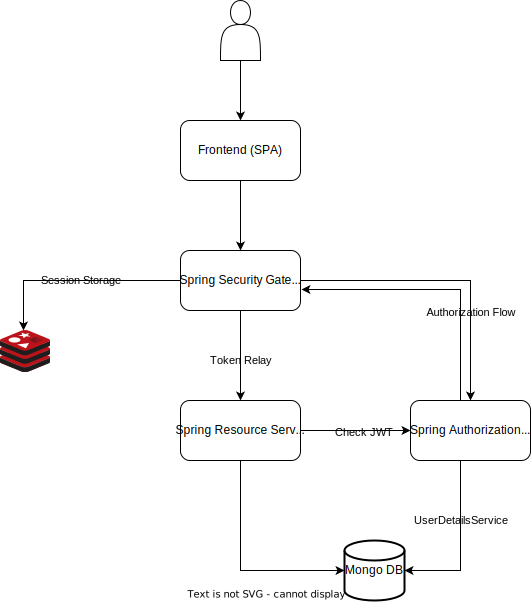

# Описание проекта

Данные учебный проект был выполнен в рамках курса OTUS Spring Framework Developer.

Проект представляет собой клон goodreads (ну почти). Поддержана возможность создавать работы
разных авторов и добавлять к этим работам конкретные издания книг, возможно для разных языков.

Добавлен аудит изменений сущностей (в самих сущностях).

Возможность регистрации пользователей.

## Схема микросервисов

## Авторизация и аутентификация

Реализован флоу Token Relay с помощью Spring Cloud Gateway и Spring Authorization Server. Все
запросы проходят через gateway, который выступает как oauth2 клиент для сервера авторизации.
Сервер авторизации генерирует jwt токены, регистрирует и логинит пользователей. При этом клиенты
публичные в виде SPA и других токены не видят и не хранят. Клиенты знают только о сессиях по кукам в
браузере, и из этой куки токен может быть получен в случае с уже аутентифицированным пользователем.

Сервер авторизации отвечает за аутентификацию, а gateway на основе полученных данных просто
ретранслирует полученный токен к ресурсному серверу. Этот самый ресурсный сервер обязан проверить
jwt токен и пустить на ресурс юзера или нет. В конфигурации с клиентом oauth на стороне security
gateway невозможно настроить авторизацию НЕ на ресурсных микросервисах. Для того, что бы так
сделать, надо добавить к security gateway зависимость resource server, таким образом он может уже
проверять токен на авторизацию по ролям.

[Более подробно](https://www.baeldung.com/spring-cloud-gateway-oauth2)

Для реализации авторизации по ролям необходимо на сервере авторизации
реализовать `OAuth2TokenCustomizer`, который будет добавлять в токен информацию о ролях юзера.
Для получения ролей из JWT токена необходимо реализовать собственный JWT конвертер на ресурсных
серверах, который уже будет доставать роли из токена и по ним осуществлять авторизацию.

В паттерне Spring Security Gateway, роль единой точки авторизации может взять на себя Spring Cloud
Gateway. Spring Cloud Gateway сохраняет сессии в редисе.

## Технологии

1. Spring Boot 3.3.0
2. Spring Cloud Eureka
3. Spring Security
    1. Role based authorization
    2. OAuth + JWT token + Token Relay pattern
4. Spring Cloud Gateway
    1. Token Relay
    2. Spring Session Redis
5. Spring Authorization Server
6. Mongo DB
7. Mongock migrations
8. Spring Data Mongo Repositories

### jasypt

Обязательно надо указать явно все параметры при шифровании

Шифрование файла с голыми
паролями - `mvn jasypt:encrypt -Djasypt.plugin.path="file:./src/main/resources/application.yml" -Djasypt.encryptor.password=masterpassword`

Шифрование строки с помощью плагина - `mvn jasypt:encrypt-value -Djasypt.encry
ptor.password=masterpassword -Djasypt.encryptor.algorithm=PBEWithMD5AndDES -Djasypt.encryptor.ivGeneratorClassName=org.jasypt.iv.NoIvGenerator -Djasypt.plugin.value=mongopass`

### Билд бэкенд контейнера

`docker build -t evawe/library-backend:1 --build-arg maven_profile=no-frontend --build-arg JASYPT_PASSWORD=masterpassword .
`

### Запуск бэкенд контейнера

`docker run --rm --name library-backend -e JASYPT_PASSWORD=masterpassword -e MONGODB_DATABASE=library -e MONGODB_PORT=27017 -e MONGODB_HOST=localhost evawe/library-backend:1`

### Зависимости для docker-compose

Для сокрытия паролей и прочих интересных переменных используется файл .env из корня проекта.

Пример содержимого файла:

`JASYPT_MASTER_PASSWORD=пароль
MONGO_CONTAINER_PASSWORD=пароль`

### zuul

Zuul не работает с версиями спринг бута выше 2.2.Х    
Необходимо использовать spring cloud gateway

